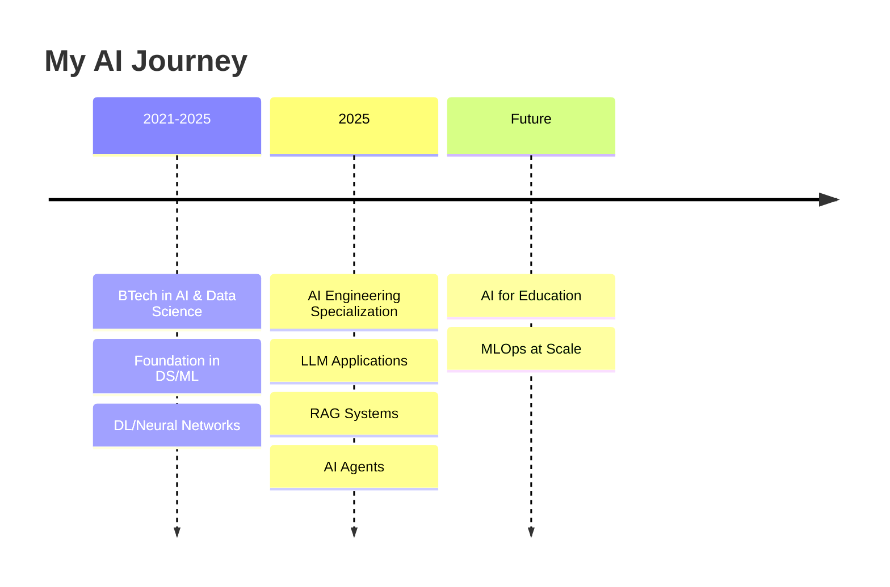

<h1 align="center">👋 Hi, I'm Aravind Yuvraj</h1>

```ascii
     _    ___   _____             _                     
    / \  |_ _| | ____|_ __   __ _(_)_ __   ___  ___ _ __ 
   / _ \  | |  |  _| | '_ \ / _` | | '_ \ / _ \/ _ \ '__|
  / ___ \ | |  | |___| | | | (_| | | | | |  __/  __/ |   
 /_/   \_\___| |_____|_| |_|\__, |_|_| |_|\___|\___|_|   
                            |___/                        
```

**🤖 Transforming Ideas into Intelligent Solutions**

[](https://linkedin.com/in/AravindYuvraj)
[](mailto:aravind98761234@gmail.com)
[](tel:+916301862099)

</div>

## 🚀 About Me

```python
class AIEngineer:
    def __init__(self):
        self.name = "Aravind"
        self.role = "AI Engineer"
        self.location = "Bengaluru, India"
        self.education = {
            "ai_engineering": "MisogiAI By Masai (2025)",
            "btech": "AI & Data Science, VNR VJIET (2021-2025)"
        }
        
    def current_focus(self):
        return [
            "🧠 Building LLM-powered applications",
            "🔗 Designing RAG systems",
            "🤖 Creating intelligent AI agents",
            "📊 End-to-end ML solutions"
        ]
    
    def expertise(self):
        return {
            "ai_technologies": ["LLMs", "RAG", "AI Agents", "Fine-tuning"],
            "frameworks": ["LangChain", "LangGraph", "MCP"],
            "languages": ["Python", "C"],
            "databases": ["MongoDB", "MySQL", "Pinecone"],
            "tools": ["Docker", "AWS", "FastAPI", "Streamlit"]
        }
```

## 🛠️ Tech Arsenal

<div align="center">

### 🧠 AI & ML Stack


### 🗄️ Data & Backend


### ☁️ DevOps & Cloud


</div>

## 🎯 Featured Projects

<details>
<summary>🎫 <strong>Intelligent Student Support Ticket Resolution System</strong></summary>

```yaml
Challenge: Automate student support to reduce response times
Solution: AI-powered full-stack system with RAG capabilities
Impact:
  - 70-80% ticket resolution without human intervention
  - Response time: Hours → Seconds
  - Cost efficiency: $0.008 per ticket
  - Monthly volume: 5,000 tickets

Tech Stack:
  - Vector Search: Pinecone + Hugging Face Embeddings
  - Context Sources: FAQs, curriculum docs, program details
  - Architecture: Full-stack with intelligent routing
```
[🔗 View Demo](Demo)

</details>

<details>
<summary>📈 <strong>Hybrid Deep Learning Stock Forecasting System</strong></summary>

```yaml
Challenge: Accurate stock price prediction and investment recommendations
Solution: TCN-LSTM hybrid model with comprehensive analysis
Performance:
  - MAPE: 1.93% (INFY) | 2.01% (TCS)
  - Features: 15 fundamental + 36 technical indicators
  - Forecast horizon: 30-day predictions
  - Output: Buy/Sell/Hold signals

Innovation:
  - 5 years historical data preprocessing
  - Hybrid architecture combining temporal patterns
  - Complete recommendation engine pipeline
```

</details>

## 🎓 Learning Journey



## 🌟 What Drives Me

<div align="center">

> *"The best way to predict the future is to invent it."* - Alan Kay

🎯 **Mission**: Building AI systems that genuinely solve real-world problems  
🚀 **Vision**: Democratizing AI to make intelligent solutions accessible to everyone  
💡 **Passion**: Exploring the intersection of creativity and artificial intelligence  

</div>

## 🤝 Let's Connect & Collaborate!

I'm always excited to discuss:
- 🤖 **AI/ML Projects** - From concept to deployment
- 💼 **Opportunities** - Building the future of intelligent systems
- ☕ **Tech Talks** - Sharing knowledge and learning together

<div align="center">

### 💌 Reach Out

[](https://linkedin.com/in/AravindYuvraj)
[](mailto:aravind98761234@gmail.com)

---

🔄 *Feel free to fork and contribute to open-source projects*  
🚀 *Let's build something amazing together!*

</div>

<div align="center">
  
</div>
